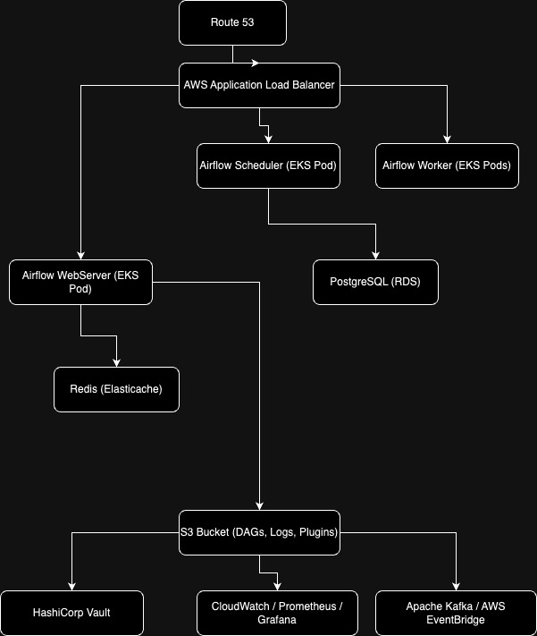

# Airflow Architecture on AWS

This repository contains documentation and architecture details for deploying Apache Airflow in a production-ready environment on AWS.

## Table of Contents

- [Architecture Overview](#architecture-overview)
- [Proposed Enhancements](#proposed-enhancements)
- [Error Fixes and Optimizations](#error-fixes-and-optimizations)
- [Execution Success Details](#execution-success-details)

## Architecture Overview

The overall Airflow architecture is described in detail in the [architecture.md](docs/architecture.md) file.

Additionally, you can find the diagram of the proposed architecture in the following image:

## Proposed Enhancements

The enhancements we propose for optimizing and scaling the Airflow deployment on AWS can be found in [enhancements_proposed.md](docs/enhancements_proposed.md).

You can also see the visual representation of these enhancements in the following image:

## Error Fixes and Optimizations

For a detailed description of errors found during the deployment and the corresponding fixes, refer to [errors_found-fixed.md](docs/errors_found-fixed.md).

## Execution Success Details

If you want to see a snapshot of successful DAG execution, refer to [airflow_execution_dag_success.png](docs/images/airflow_execution_dag_success.png).

## Proposed Architecture

For more insights into the detailed architecture with proposed enhancements, see [proposed_arch.md](docs/proposed_arch.md).

---

This documentation provides everything you need to understand the current architecture and the improvements implemented for a scalable and production-ready Apache Airflow deployment on AWS.
