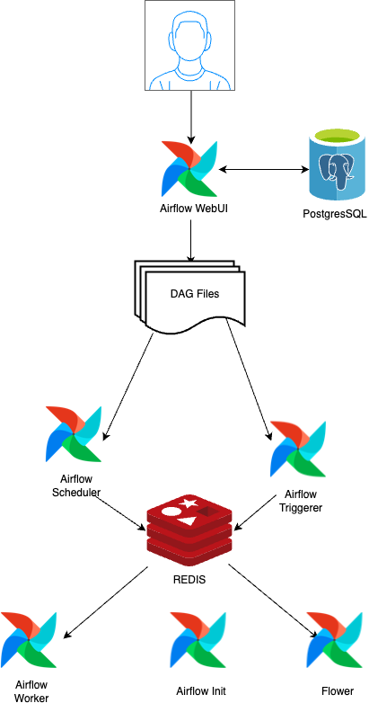

# Airflow Architecture Representation

This document provides an overview of the Airflow architecture represented in the attached diagram and suggests possible future enhancements to improve the system.

  

## Architecture Overview

### Components:

1. **Airflow Web UI**
    - The primary interface for users to interact with Airflow.
    - It communicates with **PostgreSQL** to authenticate users and retrieve DAG information.

2. **PostgreSQL**
    - Stores metadata related to DAGs, tasks, users, and their authentication information.
    - Airflow Web UI queries PostgreSQL to retrieve DAGs and task states.

3. **DAG Files**
    - Directed Acyclic Graph (DAG) files represent the workflows.
    - DAGs are centrally located and accessed by the **Scheduler**, **Triggerer**, and **Workers**.

4. **Airflow Scheduler**
    - Responsible for scheduling the tasks defined in the DAGs.
    - Interacts with Redis to place tasks into the task queue for execution by the Workers.

5. **Airflow Triggerer**
    - Responsible for triggering tasks that are deferred to be run at a specific time.
    - Works closely with Redis to manage deferred and asynchronous task execution.

6. **Redis**
    - Acts as the message broker for task distribution between the Scheduler and Workers.
    - Stores the state of task queues and serves as the task coordination point.

7. **Airflow Worker**
    - Executes tasks as they are pulled from Redis.
    - Once a task is completed, results are stored back in PostgreSQL.

8. **Airflow Init**
    - Handles initialization tasks such as database migrations, setting up the environment, creating users, etc.
    - Runs once during the initial setup of Airflow.

9. **Flower**
    - Monitors Celery workers and provides a web-based UI for viewing worker statuses.
    - Useful for tracking task execution and performance of the worker nodes.

### Diagram Summary:

- **Airflow Web UI** interacts with **PostgreSQL** for user authentication and DAG management.
- DAGs are scheduled by the **Scheduler** and can be triggered by the **Triggerer**.
- **Redis** acts as the intermediary broker between the **Scheduler**, **Workers**, and **Triggerer**.
- **Workers** execute the scheduled or triggered tasks and return the results to **PostgreSQL**.
- **Flower** is used to monitor the workers.

